### Problems this analysis is trying to solve:
1. Is there a correlation between latitude and temperature, latitude and cloudiness, latitude and humidity, and latitude and wind speeds
1. Where on a map are the cities of the world that I am studying?
1. What hotels exist within 5 km of the cities that currently have my ideal weather conditions?

### How to run the code:
1. Download and save the files "WeatherPy.ipynb" and "cities.csv" in the "WeatherPy" folder and the file "VacationPy.ipynb" in the "VacationPy" folder of the repository to a folder on your computer.
1. Open your terminal.
1. cd into the folder you saved the files in.
1. Run the command "jupyter notebook". This will open the folder in the Jupyter Notebook website.
1. Open up the WeatherPy.ipynb file on Jupyter Notebook.
1. At the top, under the "Kernal" tab, click "Restart & Run All". This will run all the cells on the page and display all the dataframes graphs.
1. Open up the VacationPy.ipynb file on Jupyter Notebook.
1. At the top, under the "Kernal" tab, click "Restart & Run All".

### Data Collected:
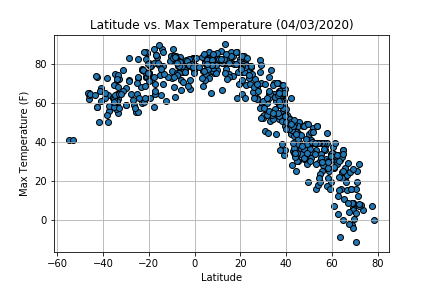
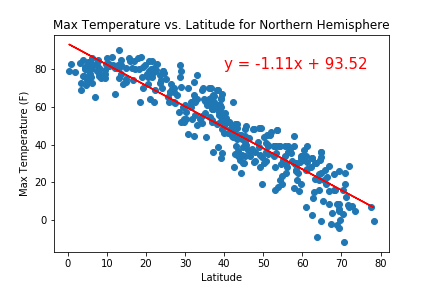
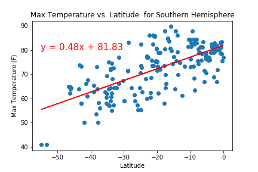
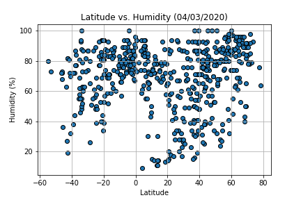
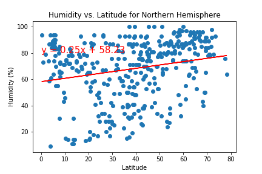
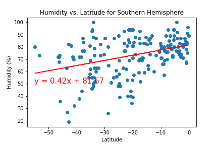
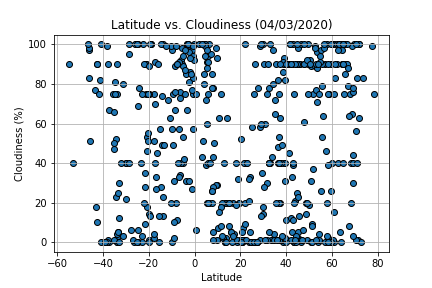
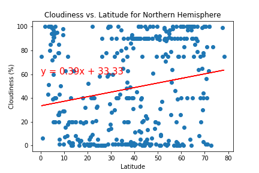
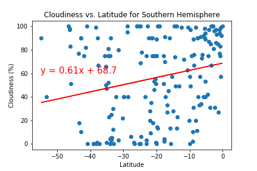
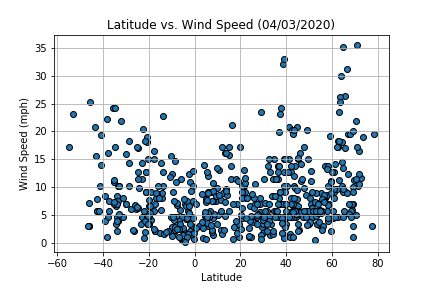
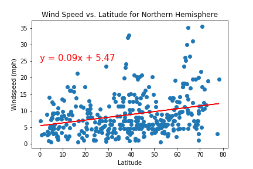
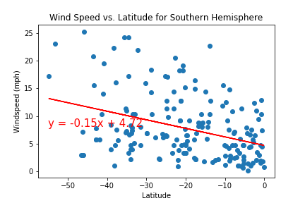

### Why the data is displayed this way:
The latitude vs. temperature/humidity/cloudiness/wind data were displayed in scatter plots to determine if there was a correlation between the variables. When the hemispheres were divided between north and south to see the correlation between the variables, a regression line and r^2 value were added in order to see exactly how strong the correlation was.
A heatmap was used to see where the cities I was studying are located. A map with markers was used to display hotels within 5 km of the cities that contain my ideal weather conditions in case I want to travel there. If you click on the markers, it gives you the hotel name, city, and country.
